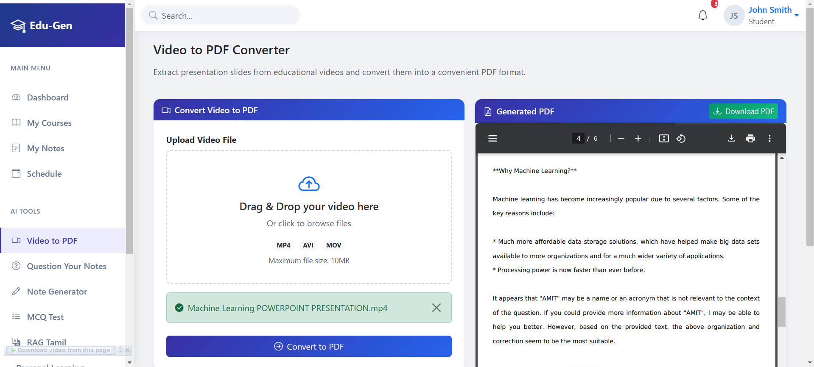
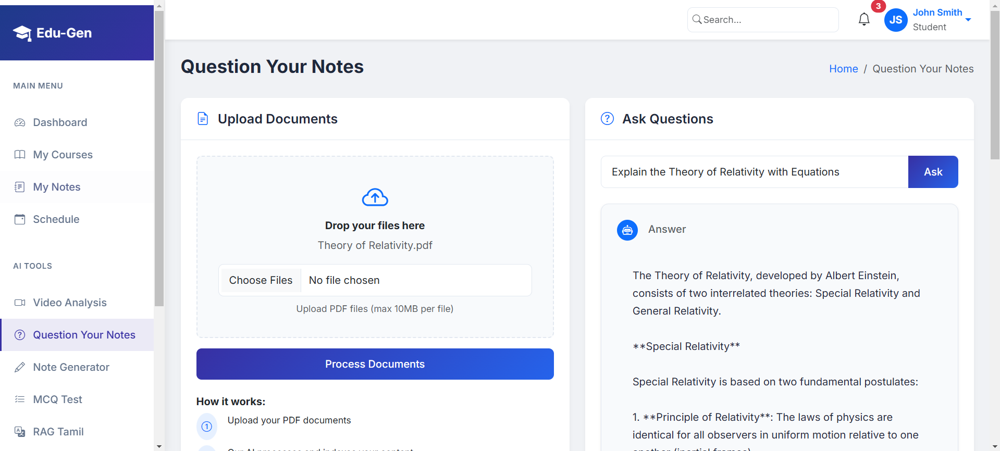
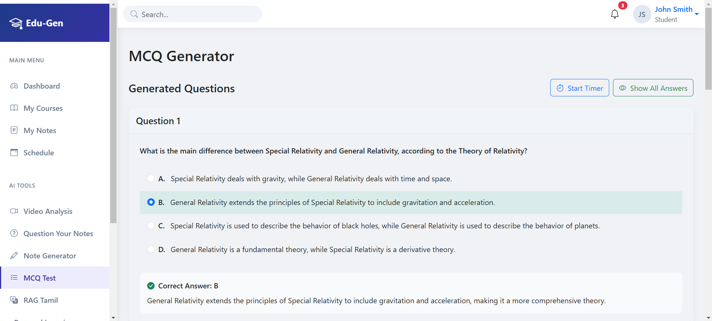

# Edu-Gen Platform

Welcome to the **Edu-Gen Platform**, a cutting-edge learning ecosystem designed to enhance how students and educators interact with content. Our platform integrates advanced technologies such as **YOLO**, **OCR**, **RAG (Retrieval-Augmented Generation)**, **BART**, **Llama**, and **GroQ** to revolutionize the learning experience, providing tools to convert videos into PDFs, generate MCQs, summarize content, create notes, and much more.


## Key Features

### 1. **Video to PDF Conversion (YOLO to OCR to PDF)**
   - **Input**: Video File
   - **Output**: PDF Document
   - Using **YOLO** for object detection and **OCR (Optical Character Recognition)** to extract text, this feature allows the conversion of videos into detailed, readable PDFs.

   

### 2. **RAG Content Summarizer**
   - **Input**: Any content (e.g., documents, articles)
   - **Output**: A concise summary
   - Leverage **RAG** to summarize lengthy documents and answer any related questions. The model intelligently retrieves relevant information and generates high-quality summaries.

   


### 3. **Notes Generation (English)**
   - **Input**: PDF Document
   - **Output**: Notes in English
   - Powered by **Mixtral-8x** and **B-32768**, this feature generates detailed, concise notes from any input PDF, making it perfect for students who need quick access to key information.

### 4. **MCQ Generation**
   - **Input**: PDF Document
   - **Output**: Customizable MCQs (Multiple Choice Questions)
   - Using the **BART** model, this feature automatically generates MCQs from the provided PDF content. You can specify the number of questions, making it ideal for teachers preparing quizzes or exams.

      

### 5. **Evaluating Memorization**
   - **Input**: PDF Document and user voice
   - **Output**: Evaluation in Grades
   - This tool compares text from notes and user-provided voice input, evaluating memorization performance using **Llama 3.3 70b** and **GroQ** for enhanced summary capabilities.


## Technologies Used

- **YOLO**: Real-time object detection
- **OCR**: Text extraction from images and videos
- **RAG (Retrieval-Augmented Generation)**: For summarizing content and answering questions
- **BART**: Automatic MCQ generation
- **Llama 3.3 70b** & **B-32768**: For generating detailed notes
- **GroQ**: Accelerates AI computations, improving note generation and Tamil localization
- **Python**, **TensorFlow**, **PyTorch**: Core development frameworks

---

## Installation and Setup

### Prerequisites
- Python 3.8 or later
- Required libraries: TensorFlow, PyTorch, Transformers, etc.
- Sufficient system resources (RAM and GPU) to handle large AI models.

### Steps
1. Clone the repository:
   ```bash
   git clone https://github.com/SIVAPRAKASH5668/HACKHAZARDS-EDUGENAI-PLATFORM.git
   ```
2. Navigate to the project directory:
   ```bash
   cd opentrack
   ```
3. Install the required dependencies:
   ```bash
   pip install -r requirements.txt
   ```
4. Run the platform:
   ```bash
   python run.py
   ```

---

## Contribution

We welcome contributions from the community! To contribute:

1. Fork the repository.
2. Create a new branch for your feature/fix.
3. Commit your changes and push to your fork.
4. Submit a pull request with a detailed explanation of your changes.

---

## License

This project is licensed under the MIT License. See the [LICENSE](LICENSE) file for more details.

---

## Team Members

- **Thillainatarajan B**
- **Siva Prakash S**

